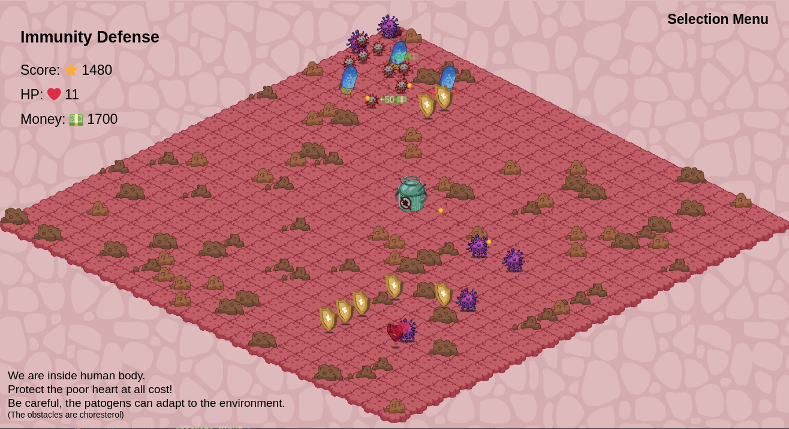

# Immunity Defense

An isometric Tower Defense game written in TypeScript.

We are inside human body, protecting the heart from SARS-CoV-2 and HIV. Build immunity towers to destroys the viruses. Be careful, the patogens can adapt to the environment.



## Setup

```npm install```

```npm run dev```

Navigate to `http://localhost:1234`

## Details

**Genre**: Tower Defense

**Space**: 2D isometric

**Objects**: obstacles, towers, enemies, item of protection

**Actions**: 
- selecting position on map
- building towers on selected positions
- selling selected towers

**Rules**: 
- player builds towers that cost money
- towers automatically shoot nearby enemies
- player receives money for each killed enemy
- there is one item of protection on the map
- enemies move towards the item of protection
- enemies adapt their moving path based on the tower placement on the map
- player can only build towers in such a way for enemies to have at least one free path to reach the item of protection
- player loses HP each time an enemy touches item of protection
- game ends when player is out of HP
- player wins if all enemies are destroyed

**Goal**: protect the item of protection from the enemies